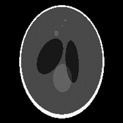

# Diffusion Models for Improved Reconstruction of DWI

# Introduction
The research of the diffusion models are basically based on the CVPR 2023 paper "[Solving 3D Inverse Problems using Pre-trained 2D Diffusion Models](https://arxiv.org/abs/2211.10655)" and the github repository https://github.com/hyungjin-chung/DiffusionMBIR.

# Contributions
The application of Diffusion Models for the reconstruction of DWI
Implementing the trained models in the ONNX format and integrating the ZSSSL model within a Docker container. 

# Docker container 
ADMM algorithm utilizing the ResNet2D ZSSSL model.
ISMRMRD format.
siemens_to_ismrmrd package. 
Additional preprocessing steps, including regridding and removing oversampling

An internal training mechanism tailored for specific matrix sizes or diffusion directions 
Dataset with 21 directions, 114 slices, 32 coils, 200 x 200 matrix size: Total time of 20 minutes (using 1 GPU-A100)
Faster than Compressed Sensing


# Stochastic Differential Equations(SDEs)


# Noise Conditioned Score Networks (NCSN)  


# Inverse Reconstruction Algorithm


# Model Training
1. Shepp Logan dataset 


2. DWI dataset 

# Reconstruction Using Diffusion Models


# Reconstruction Using Diffusion Models: fastMRI dataset


# Model generalization: cross subject 


* Make a conda environment and install dependencies
```bash
conda env create --file environment.yml
```

## Diffusion models reconstruction
Once you have the pre-trained weights and the test data set up properly, you may run the following scripts.
```bash
python run_solve_inverse_problem_simple.py
```

## Training
You may train the diffusion model with your own data by using e.g.
```bash
bash train_AAPM256.sh
```
You can modify the training config with the ```--config``` flag.


